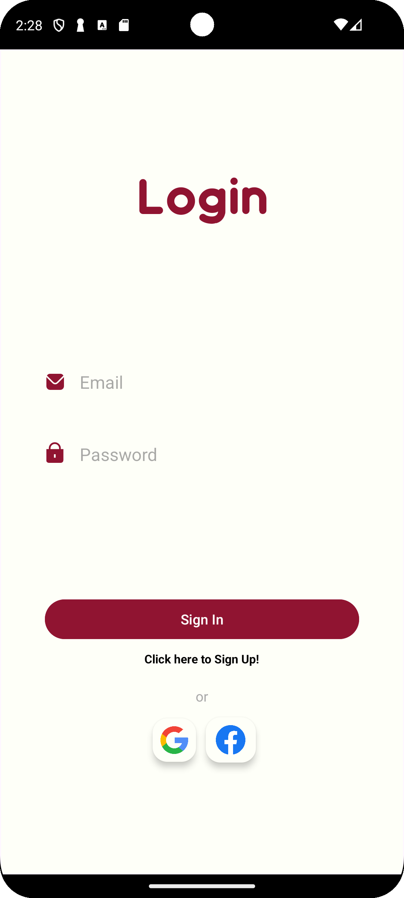
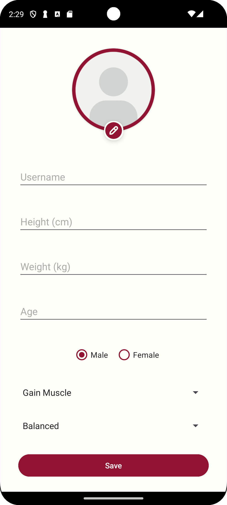
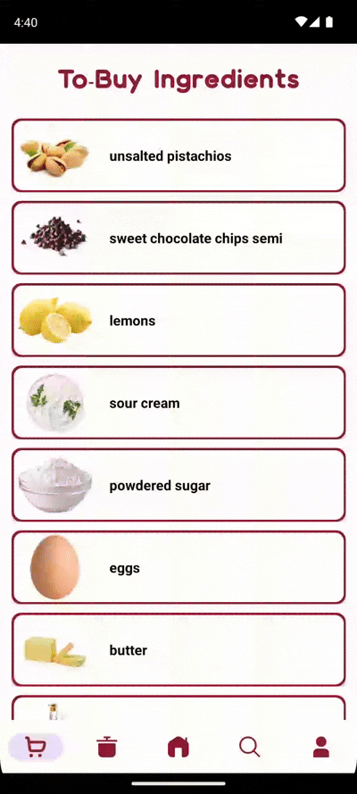
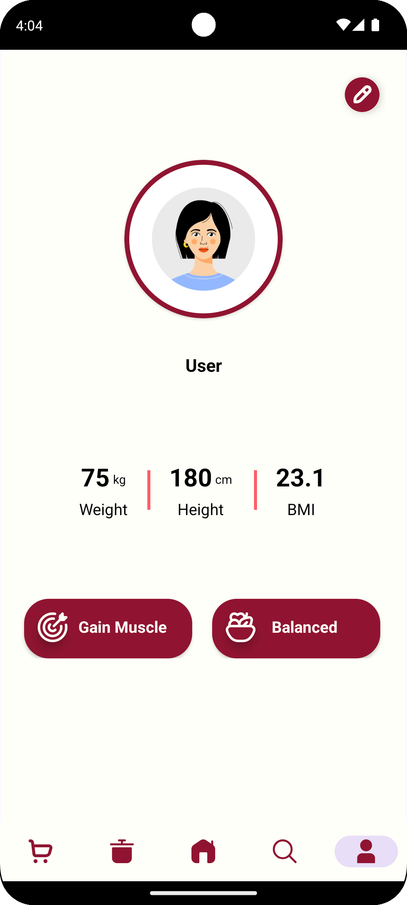
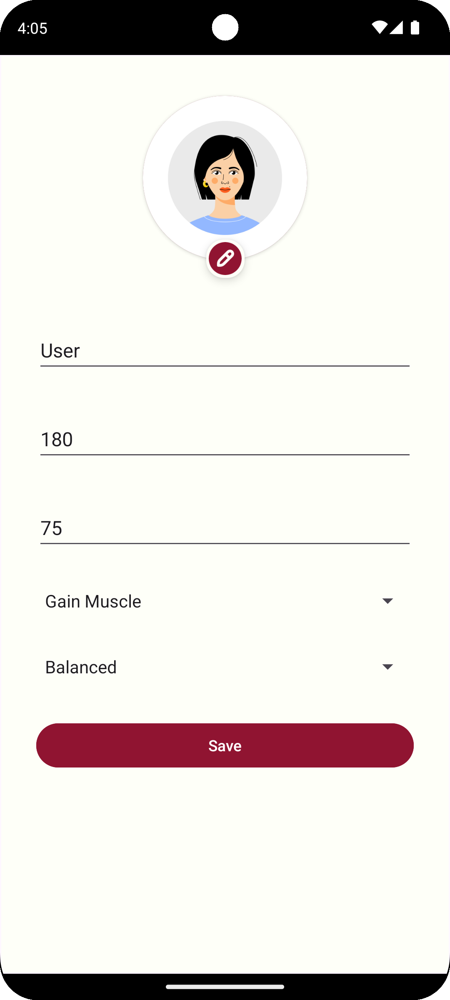

# FridgeChef AI App

**FridgeChef AI** is an Android app designed to help users discover recipes based on the ingredients available in their fridge and their nutritional goals. With AI-powered recommendations, voice-guided cooking steps, live auto-complete suggestions, and seamless cloud syncing ensures data consistency across multiple devices, the app offers a personalized cooking experience tailored to users' health and dietary preferences. 🍽️🤖

The app follows a **Bottom Navigation Bar** style, allowing users to easily navigate between different sections. The tabs are divided into the following categories:

- **Feed** 🏠
- **Special Recipes** 🍲
- **To-Buy Ingredients** 🛒
- **Profile** 👤
- **Search** 🔍
---

## App Overview

### **Intro & Authentication** 🔐

FridgeChef AI ensures a smooth and secure user experience with a comprehensive authentication process, allowing easy management of user accounts. Key features include:

- **Login:** Users can log in to the app using their credentials (email and password), providing personalized access to their profile and preferences.
- **Sign-Up:** New users can easily create an account by registering with their email address and setting up a secure password.
- **Social Sign-Up Options:** The app supports quick registration via popular social media platforms for added convenience:
    - **Google (Gmail):** Allows users to sign up or log in through their Google account.
    - **Facebook:** Offers an alternative login option via Facebook credentials.

|  |  |  |  |
|-----------------------|:-------------------:|:----------------------:|:--------------------------:|
---

### **Tabs Overview**

#### **1. Feed**
- **Infinite Recipe Feed:** Displays a combination of recipes similar to the user’s favorites, along with random suggestions.
- **Get a Cooking Tip Feature:** Offers quick, unique cooking or health tips tailored to the user’s diet and fitness goals.


|  |
|:------------------------------:|


#### **2. Special Recipes**
- **Favorite Recipes:** A collection of recipes marked as favorites by the user.
- **Cooked Recipes:** A log of previously cooked recipes for easy access.
- **AI-Generated Recipes:** Creative recipes generated by the "Go Crazy" chat-bot.

|  |
|:-------------------------------------:|

#### **3. To-Buy Ingredients**
- **Missing Ingredients Tracker:** Tracks ingredients needed for selected recipes, helping users easily identify what they need to buy and allows users to remove items they've already purchased.



#### **4. Profile**
- Displays user-specific information such as:
    - Weight, height, and BMI (automatically calculated by the app).
    - Diet type and fitness goals.
    - Personalized avatar image.

|  |  | 
|-------------------------|:--------------------------------------------:|
---


#### **5. Search**
- **Three Recipe Search Categories:**
    1. **Search by Ingredients:**
    - **Traditional Recipes:** Enter ingredients to find standard recipes using them.
    - **AI-Powered Recipes:** Enter random ingredients from your fridge, and the "Go Crazy" chatbot uses **Gemini AI** to generate innovative and creative recipes, transforming what you have on hand into unique meal ideas, while recipe and ingredient images are retrieved using the **Google Custom Search API** with a customizable search engine.

      |  |
          |:--------------------------------------------------------------:|

    2. **Search by Nutrients:** Users can select a combination of nutrients (e.g., carbs, protein, sugar, calories, fat) to filter recipes based on desired nutritional values.

       |  |
            |:------------------------------------------------------------:|

    3. **Search by Recipe Name:** A search feature that returns recipes related to the entered name, with exact or similar matches.

       |  |  
            |:-------------------------------------------------------------:|

---

### **Recipe Details & Cooking Steps** 🥗

- **Recipe Information:**
    - Displays essential recipe details, including the description, servings, cooking time, and ingredients list.

- **Get AI Opinion Feature:**
    - The AI evaluates the recipe to ensure it aligns with the user’s health goals and dietary preferences.
    - Provides suggestions to modify the recipe for better suitability.

- **Interactive Cooking Steps:**
    - Written and spoken guidance lead the user through step-by-step cooking instructions until the recipe is completed.

  |  |
    |:-------------------------------------------:|

---

### Technologies Used 🛠️

- **Programming Language:** Kotlin
- **Architecture:** MVVM (Model-View-ViewModel), Single-Activity Pattern
- **Backend Services:**
    - Firebase Authentication
    - Firebase Firestore
    - Firebase Storage
- **Database:** Room Database
- **API Integration:**
    - Spoonacular API
    - Gemini API
    - Google Custom Search API
- **Dependency Injection:** Hilt
- **Other Libraries and Technologies:**
    - Retrofit2
    - Paging3
    - Coroutines
    - Flows
    - SharedPreferences
    - TTS (Text-to-Speech)
    - Navigation Component
    - XML Layouts
    - Glide
    - Lottie

---

### Setup and Installation 🖥️

1. Install [Android Studio](https://developer.android.com/studio).
2. Clone this repository.
3. Open the project in Android Studio.
4. Add API keys for Spoonacular, Gemini, and Google Custom Search to `local.properties`:
   ```
   API_KEY_spoonacular=<Your_Spoonacular_API_Key>
   API_KEY_gemini=<Your_Gemini_API_Key>
   API_KEY_custom_search=<Your_Google_Custom_Search_API_Key>
   ```
5. Sync Gradle files.
6. Run the application on an emulator or physical device.

--- 

### Contributing 🤝
Feel free to fork the repository and submit pull requests.
